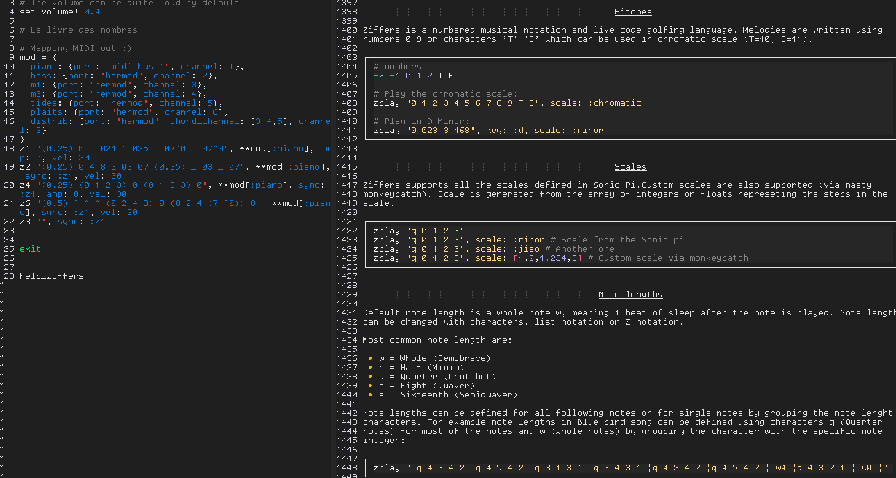

# Sonic Pipe

**This program is still highly unstable/experimental. The program is not yet properly packaged for easy distribution/installation. Use with caution, feel free to jump in and help :).**

I couldn't wait for a new version of [sonic-pi-cli](https://github.com/Widdershin/sonic-pi-cli) or [sonic-pi-tool](https://github.com/lpil/sonic-pi-tool) following the release of Sonic Pi 4.0 so I quickly hacked a CLI tool that allows strings to be piped from the command line to the Sonic Pi Server. The script is a proof of concept based on information gathered from the [Sonic Pi Forum](https://in-thread.sonic-pi.net/). Feel free to change anything and to push changes to the repo :). I don't pretend to replace or do better than the tools mentioned above. Use them if you can once they will be updated!

## TODO list

* Control logs verbosity (less printing)
* Restore Ableton Link functionality (??)
* Subfolders for help system
* Remove unused files
* Make the script available for Windows (??)

## Usage

* Install the tool using the `setup.py` file.
  1. `git clone https://github.com/Bubobubobubobubo/sonic_pipe`
  2. `cd sonic_pipe`
  3. `pip install -e .` or `pip3 install -e .` depending on your Python installation.

Required dependencies will be automatically installed. A CLI tool will be added to your path: `sonic-pipe`. In forward versions, you will also be able to import SonicPipe as a library for usage in your own Python programs.

In order to use Sonic Pipe, you will need a tool able to pipe commands from a terminal buffer to another terminal buffer. I recommend using Vim/Neovim [Slime plugin](https://github.com/jpalardy/vim-slime). Very easy to setup and straightforward to use.

## Commands

Some basic commands are available:

* **stop** : stop currently running code.
* **exit** : exit the REPL/CLI tool.
* **help** : display help files.

Sonic Pipe includes an auto-save tool for your Sonic Pipe sessions. Sessions will be automatically saved whatever happens as `.rb` files located at `$HOME/.sonic-pi/sonic-pipe-sessions/`. Files are named in accordance with the current local time of your computer for easy retrieval.

* **history** : print current session history.
* **purge-history** : delete all files from history.
* **save-history** : save the current Sonic Pipe session.
